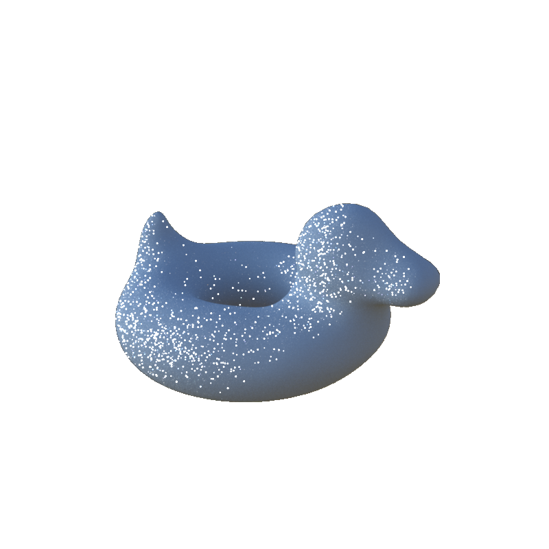
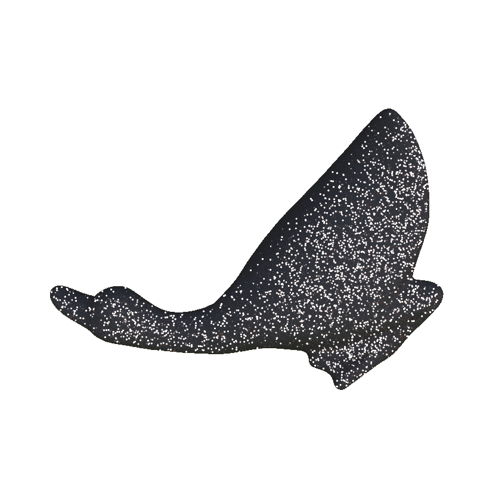
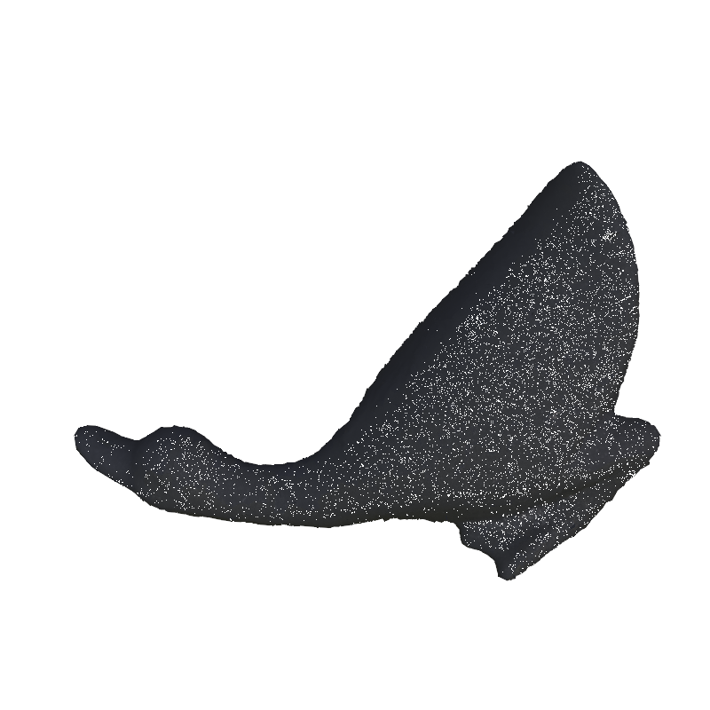
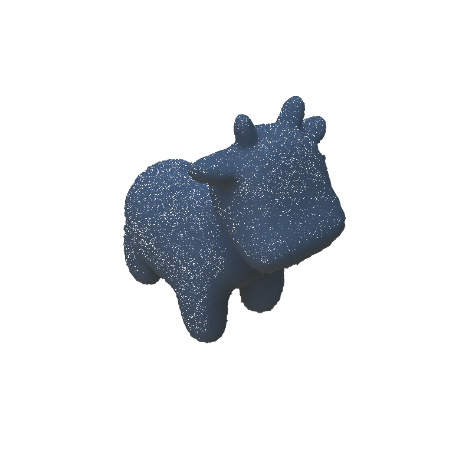

# Master's Thesis: Neural Inverse Rendering for Glinty Materials

This repository contains the code for my Master's thesis. Below is the abstract:
> _Neural inverse rendering has excelled in disentangling geometry, material, and lighting from input images, enabling scene relighting. However, prevailing pipelines relying on the Disney Bidirectional Reflectance Distribution Function (BRDF) encounter limitations in handling glinty materials due to their reliance on a smooth Normal Distribution Function (NDF). This project introduces a novel glint reconstruction method within the neural inverse rendering framework. The method features a differentiable glint sampler facilitating backpropagation, streamlining the noise generation process for glint sampling to preserve distribution and enhance efficiency. Additionally, it introduces a method for fine-grained control over glint appearance in occluded areas and a straightforward yet effective parameters approximation method. Experimental results affirm the project's pioneering status in the reconstruction of glinty materials within the neural inverse rendering paradigm._

The folder structure of this repository is shown below:
```
.
├── data_generator
│   ├── __pycache__
│   ├── env_maps
│   ├── meshes
│   │   ├── nerf
│   │   └── test_glint_num
│   └── scripts
│       └── camera_poses
├── glint_reconstruction
│   ├── configs
│   ├── dataset
│   ├── docker
│   ├── geometry
│   ├── images
│   └── render
│       └── renderutils
│           ├── c_src
│           ├── glint_brdf
│           │   └── noise_maps
│           └── tests
└── imgs
```
`data_generator` contains the code for generating the data used in the project. `glint_reconstruction` contains the code for the proposed glint reconstruction method in Pytorch. `imgs` contains the images used in this README.

Please go to each folder to see how to run the code.

## Results
Some results of the project are shown below. The images on the left are the reference images, and the images on the right are the rendered images using the proposed method.
<div>
    
    
    <br>
    <i>Bob</i> with <i>Clarens</i> Environment Map
</div>
<div>
    
    
    <br>
    <i>Duck</i> with <i>Golf</i> Environment Map
</div>
<div>
    
    
    <br>
    <i>Spot</i> with <i>Road</i> Environment Map
</div>

